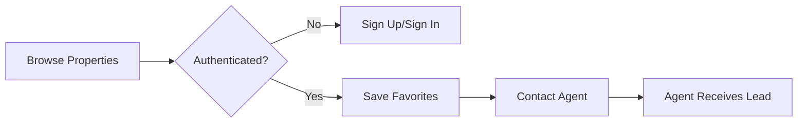
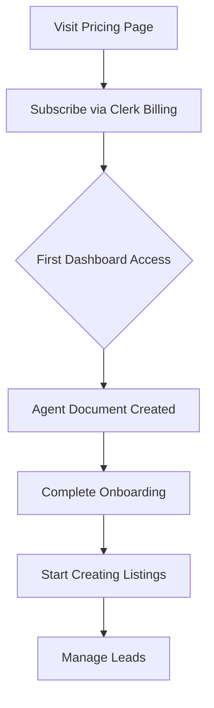
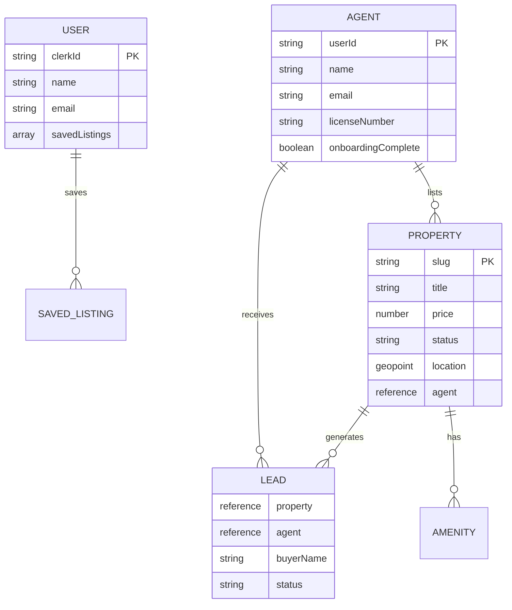

# 🏠 Nestwell - Find Your Perfect Home

> ⚠️ **Disclaimer:** This project is for **educational purposes only**. We are not affiliated with, associated with, or endorsed by Zillow Group, Inc. in any way. "Zillow" is a registered trademark of Zillow Group, Inc. This project does not intend to infringe on any copyrights or trademarks. It is a learning exercise to demonstrate modern web development techniques.

[](https://creativecommons.org/licenses/by-nc/4.0/)


**A modern real estate platform that makes buying your first home simple and stress-free.**

> 🎯 **Who is this for?**
> First-time homebuyers looking for a clean, intuitive property search experience, AND real estate agents who want to list properties, manage leads, and grow their business.

> ⚡ **What problem does it solve?**
> Traditional real estate platforms are cluttered and overwhelming. Nestwell provides a clean, modern interface with real-time updates, interactive maps, and a seamless agent subscription system.

> 🔥 **Technical highlights:**
> - Real-time content with Sanity Live (no page refreshes!)
> - Sanity Studio as your super admin dashboard
> - Clerk Billing integration (no webhooks needed)
> - Interactive Mapbox maps with property markers
> - Type-safe schemas with auto-generated TypeScript (typegen)
> - Server Actions + Server Components for optimal performance
> - React 19 + React Compiler for blazing fast renders

## 🤔 What Is This App?

Think of Nestwell as **Zillow meets modern web development** — a sleek real estate platform where homebuyers can browse listings, save favorites, and contact agents, while real estate professionals can manage their portfolio through a dedicated dashboard.

**For homebuyers:** Search properties by city, price range, bedrooms, bathrooms, and property type. Toggle between grid and map views. Save your favorites and reach out to agents when you're ready.

**For agents:** Subscribe to the Agent plan, complete your profile, and start listing properties. Manage leads from potential buyers, track analytics, update listing statuses, and monitor your performance from a comprehensive dashboard.

### Popular Use Cases

- 🏡 **First-time homebuyer** browsing properties in a new city
- 🏢 **Real estate agent** managing their listing portfolio
- 🔍 **Property investor** researching market opportunities
- 📱 **Relocating professional** searching for apartments remotely

---

## ✨ Features

### For Homebuyers (Free)

| Feature | Description |
|---------|-------------|
| 🔍 **Advanced Search** | Filter by price, beds, baths, property type, amenities, and location |
| 🗺️ **Interactive Map** | View properties on a Mapbox-powered map with price markers |
| 💾 **Save Favorites** | Build a collection of properties you love |
| 📧 **Contact Agents** | Reach out to listing agents directly |
| 🖼️ **Image Galleries** | Browse high-quality property photos |
| 📱 **Responsive Design** | Works beautifully on any device |

### For Real Estate Agents (Paid - $29/month)

| Feature | Description |
|---------|-------------|
| 📊 **Analytics Dashboard** | Track views, leads, and performance with charts |
| 🏠 **Unlimited Listings** | Create and manage property listings with image uploads |
| 📬 **Lead Inbox** | View and manage buyer inquiries |
| 📍 **Address Autocomplete** | Mapbox-powered address search with geocoding |
| ✏️ **Listing Management** | Update status (Active/Pending/Sold) |
| 👤 **Professional Profile** | Showcase your bio, agency, and license |
| 💳 **Billing Management** | Manage subscription via Clerk |

### Technical Features (The Smart Stuff)

| Feature | Why It Matters |
|---------|----------------|
| 🔄 **Real-Time Updates** | Sanity Live pushes content changes instantly — no page refreshes |
| 🎛️ **Sanity Studio** | Built-in super admin dashboard at `/studio` for content management |
| 📐 **Schema + Typegen** | Define content schemas once, auto-generate TypeScript types |
| 💳 **Clerk Billing** | Subscription management without complex webhook setups |
| 🗄️ **Type-Safe Queries** | GROQ queries with `defineQuery` + auto-generated types |
| ⚙️ **Server Actions** | Form submissions handled server-side for security |
| 🎨 **React 19 + Compiler** | Automatic optimizations for component renders |
| 📍 **Geocoding** | Mapbox SDK for address autocomplete and coordinates |
| 📈 **Analytics Charts** | Recharts for beautiful data visualization |

---

## 🔄 How It Works

### User Flow



### Agent Subscription Flow



### Data Architecture



---

## 🚀 Getting Started

### Prerequisites

Before you begin, ensure you have:

- [x] Node.js 20+ installed
- [x] pnpm (recommended) or npm
- [x] Clerk account with Billing enabled
- [x] Sanity project created
- [x] Mapbox access token

### Step-by-Step Setup

**1. Clone the repository**

```bash
git clone https://github.com/your-username/nestwell.git
cd nestwell
```

**2. Install dependencies**

```bash
pnpm install
```

**3. Set up environment variables**

Create a `.env.local` file in the root directory:

```env
# Clerk - Authentication & Billing
NEXT_PUBLIC_CLERK_PUBLISHABLE_KEY=pk_test_xxxxx
CLERK_SECRET_KEY=sk_test_xxxxx
NEXT_PUBLIC_CLERK_SIGN_IN_URL=/sign-in
NEXT_PUBLIC_CLERK_SIGN_UP_URL=/sign-up

# Sanity - CMS
NEXT_PUBLIC_SANITY_PROJECT_ID=your-project-id
NEXT_PUBLIC_SANITY_DATASET=production
SANITY_API_TOKEN=your-write-token

# Mapbox - Maps & Geocoding
NEXT_PUBLIC_MAPBOX_TOKEN=pk.xxxxx
MAPBOX_ACCESS_TOKEN=pk.xxxxx

# App URL (for metadata)
NEXT_PUBLIC_APP_URL=http://localhost:3000
```

> 🔒 **Security Note:** Never commit `.env.local` to version control. The `.gitignore` already excludes it.

> 💡 **Tip:** Variables prefixed with `NEXT_PUBLIC_` are exposed to the browser. Keep sensitive tokens (like `CLERK_SECRET_KEY` and `SANITY_API_TOKEN`) without this prefix.

**4. Set up Sanity**

```bash
# Generate TypeScript types from your schema
pnpm typegen
```

**5. Set up Clerk Billing**

In your Clerk Dashboard:
1. Enable Billing in your application
2. Create a "Free" plan (no price)
3. Create an "Agent" plan at $29/month
4. The app uses `has({ plan: "agent" })` to check subscriptions

**6. Seed the database (optional)**

```bash
# Seed sample data
pnpm seed

# Clean and reseed
pnpm seed:clean
```

**7. Run the development server**

```bash
pnpm dev
```

Open [http://localhost:3000](http://localhost:3000) to see the app.

**8. Access Sanity Studio (Admin Dashboard)**

Navigate to [http://localhost:3000/studio](http://localhost:3000/studio) to manage content:
- Create/edit properties
- Manage agents and users
- View leads
- Full CMS control with real-time preview

### ✅ First Time Setup Checklist

- [ ] Created Clerk application with Billing enabled
- [ ] Created Sanity project and obtained tokens
- [ ] Got Mapbox access token
- [ ] Set up all environment variables
- [ ] Generated TypeScript types with `pnpm typegen`
- [ ] (Optional) Seeded database with sample data

---

## 🗄️ Database Schema Overview

### Collections

| Collection | Purpose | Key Fields |
|------------|---------|------------|
| `property` | Property listings | title, price, status, location, agent ref, amenities |
| `agent` | Agent profiles (linked to Clerk) | userId, name, licenseNumber |
| `user` | Homebuyer profiles | clerkId, savedListings |
| `lead` | Buyer inquiries | property ref, agent ref, status |
| `amenity` | Property amenities | name, icon, category |

### Key Design Decisions

1. **Lazy Agent Creation**: Agent documents are created on first dashboard access (after subscribing), not via webhooks. Clerk Billing is the source of truth.

2. **Geopoint for Location**: Properties use Sanity's `geopoint` type for accurate map placement.

3. **Reference Relationships**: Properties reference their agent, leads reference both property and agent for efficient querying.

4. **Seed ID Prefixes**: Seeded data uses `seed_` prefixed IDs for easy cleanup during development.

---

## 🚢 Deployment

### Deploy to Vercel

**Option 1: Vercel CLI**

```bash
# Install Vercel CLI
pnpm i -g vercel

# Deploy
vercel
```

**Option 2: GitHub Integration**

1. Push your code to GitHub
2. Import the repository in Vercel Dashboard
3. Add environment variables
4. Deploy!

### Post-Deployment Checklist

- [ ] Verify all environment variables are set in Vercel
- [ ] Test authentication flow
- [ ] Test subscription/billing flow
- [ ] Verify Sanity content is loading
- [ ] Check maps are rendering correctly
- [ ] Set up CORS origins in Sanity (if needed)

### Monitoring (Recommended)

- **Vercel Analytics** - Page performance
- **Clerk Dashboard** - Auth metrics
- **Sanity Manage** - Content analytics

---

## ❓ Common Issues & Solutions

### Development Issues

| Problem | Solution |
|---------|----------|
| `NEXT_PUBLIC_SANITY_PROJECT_ID` is undefined | Make sure `.env.local` is in the root directory and restart the dev server |
| Sanity types not generating | Run `pnpm typegen` after schema changes |
| Maps not showing | Verify `NEXT_PUBLIC_MAPBOX_TOKEN` is set correctly |
| Address autocomplete not working | Check both `NEXT_PUBLIC_MAPBOX_TOKEN` and `MAPBOX_ACCESS_TOKEN` |

### Authentication Issues

| Problem | Solution |
|---------|----------|
| Sign-in redirects to wrong page | Check `NEXT_PUBLIC_CLERK_SIGN_IN_URL` in env |
| Billing not working | Enable Billing in Clerk Dashboard and create plans |
| Agent dashboard 404s | Subscribe to Agent plan first, then access dashboard |

### Database Issues

| Problem | Solution |
|---------|----------|
| No properties showing | Run `pnpm seed` to add sample data |
| Images not loading | Check Sanity CORS settings and image URL configuration |
| Real-time not working | Verify `SanityLive` component is rendered in layout |

### Build/Deploy Issues

| Problem | Solution |
|---------|----------|
| Build fails on Vercel | Ensure all env variables are added in Vercel settings |
| Type errors after schema change | Run `pnpm typegen` and commit generated files |

---

## 🏆 Take It Further - Challenge Time!

Ready to level up? Try adding these features:

### 🎨 UI Enhancements

- [ ] Dark mode toggle with `next-themes`
- [ ] Property comparison tool (compare 2-3 properties side by side)
- [ ] Virtual tour integration (Matterport embed)
- [ ] Neighborhood insights section

### 🤖 AI Improvements

- [ ] AI-powered property descriptions (OpenAI)
- [ ] Smart property recommendations based on saved listings
- [ ] Chatbot for property inquiries
- [ ] Image auto-tagging for amenities

### 🏗️ Infrastructure & Scaling

- [ ] Add Redis caching for search results
- [ ] Implement ISR for property pages
- [ ] Add Algolia for full-text search
- [ ] Set up scheduled Sanity backups

### 💰 Monetization Features

- [ ] Featured listing upgrades for agents
- [ ] Lead priority tiers
- [ ] Analytics dashboard for agents (views, saves, etc.)
- [ ] Referral program

---

## 📄 License

This project is licensed under [CC BY-NC 4.0](LICENSE.md).

### ✅ You CAN

- Use this code for **personal projects**
- Use this code for **learning purposes**
- Modify and adapt the code
- Share with attribution

## 📚 Quick Reference

### Useful Commands

```bash
# Development
pnpm dev          # Start dev server
pnpm build        # Build for production
pnpm start        # Start production server
pnpm lint         # Run Biome linter
pnpm format       # Format code

# Database
pnpm typegen      # Generate Sanity types
pnpm seed         # Seed sample data
pnpm seed:clean   # Clean and reseed
```

### Key Files & Folders

```
├── app/
│   ├── (main)/           # Public pages (home, properties, pricing)
│   ├── (dashboard)/      # Agent dashboard (protected)
│   │   └── dashboard/
│   │       ├── analytics/    # Performance charts
│   │       ├── billing/      # Subscription management
│   │       ├── leads/        # Lead inbox
│   │       └── listings/     # Property management
│   └── studio/           # Sanity Studio
├── components/
│   ├── forms/            # Form components + fields
│   ├── layout/           # Navbar, Footer, Sidebar
│   ├── map/              # Mapbox components
│   ├── property/         # Property cards, grids, filters
│   └── ui/               # shadcn/ui components
├── actions/              # Server Actions
├── lib/
│   ├── sanity/           # Client, queries, live, upload
│   ├── hooks/            # Custom React hooks
│   └── geocoding.ts      # Mapbox geocoding utilities
├── sanity/schemas/       # Content schemas
└── scripts/seed/         # Database seeding
```

### Important Concepts

| Concept | Description |
|---------|-------------|
| **Server Actions** | Functions in `actions/` that run server-side |
| **Sanity Live** | Real-time content updates via `SanityLive` component |
| **Clerk Billing** | Subscription checks via `has({ plan: "agent" })` |
| **defineQuery** | Type-safe GROQ query builder from `next-sanity` |
| **Typegen** | Auto-generate TS types from Sanity schemas |

---

